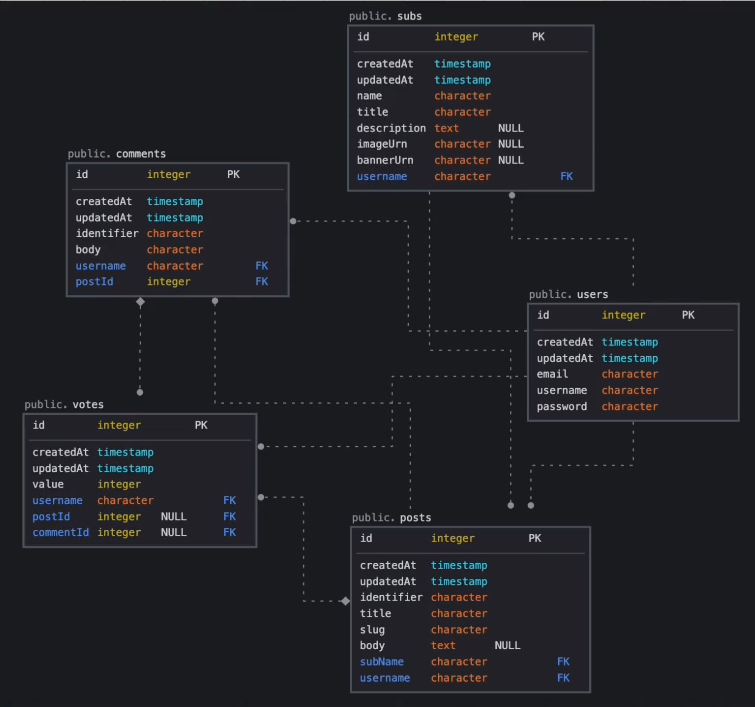

### var

- 중복선언 가능, 재할당 가능
- 함수 레벨 스코프 (function-level scope)
- Scope란, 유효한 참조 범위를 말한다.

```js
function func() {
  if (true) {
    var a = 'a';
    console.log(a); // 잘 출력된다.
  }
  console.log(a); // 이 부분은 아직도 함수안이므로 console이 잘 찍힌다.
}

console.log(a); // 함수 밖이므로 오류가 난다.

func();
```

- 즉, var의 유효한 참조 범위는 함수 레벨 스코프이다.

### let

- 중복선언 불가능, 재할당 가능
- 블록 레벨 스코프 (block-level scope)

### const

- 중복선언 불가능, 재할당 불가능
- 블록 레벨 스코프 (block-level scope)

```js
function func() {
  if (true) {
    let a = 'a';
    const b = 'b';
    console.log(a); // 잘 출력된다.{}안이 블록레벨
    console.log(b); // 잘 출력된다.{}안이 블록레벨
  }
  console.log(a); // 블록을 벗어남. 오류가 난다.
  console.log(b); // 블록을 벗어남. 오류가 난다.
}

func();
```

### 호이스팅 (Hoisting)

- 호이스트의 뜻은 무언가를 들어 올리거나 끌어 올리는 동작을 설명한다.
- 자바스크립트에서 호이스팅은 코드가 실행되기 전에 변수 및 함수 선언(이름)이 로컬 범위(유효 범위)의 맨 위로 들어올려지거나 끌어올려지는 경우를 설명한다.
- 변수 생성 --> 선언단계 // 할당단계 --> var greeting // = 'hello'
- 자바스크립트는 인터프리터언어. 위에서 부터 한줄씩 읽어가는 언어.
- var로 선언하면 인터프리터니까 error가 날것 같은데 undefined라고 나오는 이유가 호이스팅하기 때문이다. 호이스팅되면 선언이되고, undefined값을 넣어준다. 그래서 콘솔을 찍어보면 undefined가 나오게 되고 그 아래 부분에서 hello라는 값을 할당한다.

```js
console.log(greeting); // undefined
var greeting = 'hello';

console.log(greeting1); // error
let greeting1 = 'hello';

console.log(greeting2); // error
const greeting2 = 'hello';
```

```js
func();

function func() {
  console.log('hoisting test');
}
```

- 함수도 호이스팅 됨. 위와 같이 호출해도 잘 작동함.

- let, const 변수를 선언하면 실제로 변수는 호이스팅 된다. 그러나 var과 차이점은 var는 실제 할당 값이 할당되기전 까지 undefined값이 할당 되지만, let, const는 변수 초기에 어떤 값도 할당되지 않는다.

- 선언단계 부터 할당단계 사이를 TDZ (Temporal Dead Zone)이라고 부른다. 콘솔로 출력하려고 하면 에러가 나는 부분이다.

- let, var, const 결론 : 변수를 생성할 때 재할당이 필요없다면 const를 사용한다. 재할당이 필요하면 let을 사용하지만 변수의 scope를 최대한 좁게 만들어서 사용한다.

### 자바스크립트 타입

- 원시타입 : boolean, string, number, null, undefined, symbol (불변성을 갖고 있다.)

- 참조타입 : function, array, classes, object

- 원시타입은 고정된 크기로 Call Stack 메모리에 저장이 된다.(실제 데이터가 변수에 할당.) 참조 타입은 크기가 정해지지 않고 Call Stack메모리에 저장, 데이터 값이 Heap에 저장이 되고, Heap의 주소가 Call Stack에 저장이된다.
- 기본적으로 자바스크립트는 원시 타입에 대한 값을 저장하기 위해 Call Stak 메모리 공간을 사용하지만, 참조 타입의 경우 Heap이라는 별도의 메모리 공간을 사용한다. 이 경우 Call Stack은 개체 및 배열 값이 아닌 Heap 메모리 참조 ID를 값으로 저장한다.

- 자바스크립트는 동적 타입이다 : 느슨한 타입(loosely typed)의 동적(dynamic)언어이다. 자바스크립트의 변수는 어떤 특정 타입과 연결되지 않으며, 모든 타입의 값으로 할당(및 재할당) 가능하다.

```js
let foo = 42; // foo가 number
foo = 'bar'; // foo가 string
foo = true; // foo가 boolean
// 자바스크립트는 동적 타입.
```

- 같은 변수가 여러개의 타입을 가질 수 있다.
- 타입을 명시하지 않아도 된다.
- 대부분의 다른 언어는 정적(static)타입 언어이다. (자바, C#, C++등)

```js
const sym = Symbol();

// 참조타입
const hobbies = ['walking', 'books']; // Array 배열
const address = { province: '경기도', city: '성남시' }; // Object 배열

console.log(typeof hobbies); // object로 return해줌. 배열인지 객체인지 알 수없음.
console.log(Array.isArray(hobbies)); // true라고 나오면 array타입. array 확인은 Array.isArray를 이용해서 확인한다.
```

### Loops

- 자바스크립트에서 루프를 사용하면 코드 블록을 여러 번 실행할 수 있게 해준다.
- for : 코드 블록을 여러 번 반복
- for/in : 객체의 속성을 따라 반복
- while : 지정된 조건이 true인 동안 코드 블록을 반복
- do/while : 코드 블록을 한번 실행하고, 조건이 true인 동안 루프를 반복한다.

```js
for (let i = 0; i < 10; i++) {
  if (i === 3) {
    console.log('It is 3');
    continue;
  }

  if (i === 5) {
    console.log('5 Stop the loop');
    break;
  }

  console.log('Number' + i);

  // Number 0
  // Number 1
  // Number 2
  // It is 3
  // Number 4
  // 5 Stop the loop
}
```

```js
const user = {
  name: 'Bin',
  province: '서울시',
  city: '강남구',
};

for (let x in user) {
  console.log(`${x} : ${user[x]}`);
}

// name : Bin
// province : 서울시
// city : 강남구
```

```js
let i = 0;

while (i < 5) {
  console.log('Number' + i);
  i++;
}

// Number 0
// Number 1
// Number 2
// Number 3
// Number 4
```

```js
let i = 100;

do {
  console.log('Number' + i);
  i++;
} while (i < 10);

// Number 100
```

- 배열을 Loop로 이용해서 컨트롤 해주기

```js
const locations = ['서울', '부산', '경기도', '강원도'];

// for
for (let i = 0; i < locations.length; i++) {
  console.log(locations[i]);
}
// 서울
// 부산
// 경기도
// 강원도

// foreach
locations.forEach((location, index, array) => {
  console.log(`${index} : ${location}`);
  console.log(array);
});

// 0 : 서울
// ["서울", "부산", "경기도", "강원도"]
// 1 : 부산
// ["서울", "부산", "경기도", "강원도"]
// 2 : 경기도
// ["서울", "부산", "경기도", "강원도"]
// 3 : 강원도
// ["서울", "부산", "경기도", "강원도"]

locations.map((location) => {
  console.log(location);
});

// 서울
// 부산
// 경기도
// 강원도
```

- for vs foreach
- for루프는 원래 사용되었던 접근 방식이지만 forEach는 배열 요소를 반복하는 새로운 접근 방식이다.
- for루프는 필요한 경우 break문을 사용하여 for 루프를 중단할 수 있지만 forEach에서는 이와 같은 작업을 수행할 수 없다.
- for루프는 await와 함께 작동하지만 forEach는 await와 완벽하게 작동하지 않는다.
- for루프는 사용한 성능은 forEach루프보다 빠르다.

### Window Object

- window 객체는 브라우저에 의해 자동으로 생성되며 웹 브라우저의 창(window)을 나타낸다.
- 또한, window는 브라우저의 객체이지 javascript의 객체가 아니다.
- 이 window 객체를 이용해서,
  1. 브라우저의 창에 대한 정보를 알 수 있고, 이 창을 제어하고 할 수도 있습니다.
  2. 또한 var 키워드로 변수를 선언하거나 함수를 선언하면 이 window 객체의 프로퍼티가 된다.

### DOM (Document Object Model)

- 돔(문서 객체 모델)은 메모리에 웹 페이지 문서 구조를 트리구조로 표현해서 웹 브라우저가 HTML 페이지를 인식하게 해준다.
- 또한 위에서 보는 웹 페이지를 이루는 요소들을 자바스크립트가 이용할 수 있게끔 브라우저가 트리구조로 만든 객체 모델을 의미한다.
- HTML을 분석해서 DOM트리를 만들고, DOM트리를 이용해 화면을 보여준다.

- Browser Object Model (BOM)

  - window.location
  - window.navigator
  - window.history
  - window.screnn

- Document Object Model (DOM)

  - window.document

- 돔 조작
  - DOM 트리를 DOM에서 제공해주는 API를 이용해서 조작할 수 있다.
  - 이 API를 이용해서 DOM 구조에 접근하거나 원하는 요소(Element)를 수정하거나 없애거나 할 수 있다.

```js
<button class="button">Click Me</button>;

var button = document.querySelector('.button');
// DOM안에 클래스가 button이라는 이름을 가진 요소에 접근

button.onclick = function () {
  this.style.backgroundColor = 'red';
};
// DOM안에 있는 요소의 스타일을 직접 변경(DOM 조작)
```

- 웹 페이지 빌드 과정 (Critical Rendering Path, CRP)

  - 브라우저가 서버에서 페이지에 대한 HTML응답을 받고 화면에 표시하기 전에 여러 단계가 있다. 웹 브라우저가 HTML 문서를 읽고, 스타일 입히고 뷰포트에 표시하는 과정이다.

- Document 객체 메소드 사용
- Document 객체의 메서드들을 사용하면 다양한 방법으로 웹 페이지 내의 태그들에 접근할 수 있다.

```js
document.getElementById(요소아이디); // 파라미터로 전달한 ID를 가진 태그를 반환
document.getElementByName(name속성값); // 파라미터로 전달한 name속성을 가진 태그를 반환
document.querySelector(선택자); // 파라미터로 전달한 선택자에 맞는 첫 번째 태그를 반환
```

```js
document.querySelector('li').style.color = 'blue';
document.querySelector('ul li').style.color = 'red';

document.querySelector('li:last-child').style.color = 'red';
document.querySelector('li:last-child(3)').style.color = 'orange';
document.querySelector('li:last-child(4)').textContent = 'Hello World';
document.querySelector('li:last-child(odd)').style.background = 'gray';
document.querySelector('li:last-child(even)').style.background = 'lightgray';
```

- 여러 요소에 접근

```js
document.getElementsByTagName(태그이름); // 파라미터로 전달한 태그이름을 가진 모든 태그들을 반환(배열)
document.getElementsByClassName(클래스이름); // 파라미터로 전달한 클래스 이름을 가진 모든 태그들을 반환(배열)
document.querySelectorAll(선택자); // 파라미터로 전달한 선택자에 맞는 모든 태그들을 반환(배열)
```

### DOM Event

- Event Listener

  - 마우스를 이용해서 버튼을 클릭할 때는 클릭 "이벤트"가 발생한다.
  - 이벤트가 발생했을 때 어떠한 액션을 위한 함수를 호출하는데 그 함수가 바로 이벤트 리스너이다.

  1. 자바스크립트 코드에서 프로퍼티로 등록

  ```js
  window.onload = function () {
    // 문서가 load 될 때 이 함수 실행

    let text = document.getElementById('text');
    // 아이디가 "text"인 요소를 return

    text.innerHTML = 'HTML 문서 loaded';
  };
  ```

  2. HTML 태그에 속성으로 등록

  ```html
  <button onclick="alert('버튼이 클릭됐습니다.')">버튼입니다.</button>
  ```

  3. addEventListener 메소드를 사용

  ```js
  // element.addEventListener(이벤트명, 실행할 함수명(listener), 옵션);
  const aElement = document.querySelector('a');
  aElement.addEventListener('click', () => {
    alert('a element clicked');
  });
  ```

### Event 종류

1. UI 이벤트

- load: 문서나 객체가 로드 완료 되었을 때 발생
- change: 객체의 내용이 변동되거나 focus를 잃었을 때 발생
- resize: 객체의 크기가 바뀌었을 때 발생
- scroll: 스크롤바를 조작할 때 발생
- error: 에러가 발생했을 때 발생

2. 키보드 이벤트

- keydown: 키를 눌렀을 때 발생
- keyup: 키를 눌렀다가 뗏을 때 발생
- keypress: 사용자가 눌렀던 키의 문자가 입력되었을 때 발생

3. 마우스 이벤트

- click: 객체를 클릭했을 때 발생
- dblclick: 객체를 더블클릭했을 때 발생
- mousedown: 마우스를 클릭했을 때 발생
- mouseout: 마우스가 특정 객체 밖으로 나갔을 때 발생
- mouseover: 마우스가 특정 객체 위로 올려졌을 때 발생
- mousemove: 마우스가 움직였을 때 발생
- mouseup: 마우스에서 손을 뗏을 때 발생

4. 포커스 이벤트

- focus: 객체에 focus가 되었을 때 발생
- blur: 객체가 focus를 잃었을 때 발생

5. 폼 이벤트

- input: input,textarea 요소 값이 변경되었을 때 발생
- change: 선택 상자, 체크박스, 라디오버튼의 상태가 변경되었을 때 발생
- select: 텍스트를 선택을 했을 때 발생
- reset: 리셋 버튼을 눌렀을 때 발생
- submit: 사용자가 버튼키 등을 활용하여 폼을 전송할 때 발생
- cut/copy/paste: 사용자가 폼필드의 콘텐츠를 잘라내기/복사/붙여넣기 했을 때 발생

### OOP (Object-oriented programming)란?

- 객체 지향 프로그래밍(OOP)은 JAVA 및 C++를 비롯한 많은 프로그래밍 언어의 기본이 되는 프로그래밍 패러다임 이다.
- 객체 지향 프로그래밍은 여러개의 독립된 단위 "객체"들의 모임으로 컴퓨터 프로그램을 파악한다.
- 객체 지향 프로그래밍은 객체들의 모임이다.
- 객체 지향 프로그래밍이 나오기 이전에는 명령어의 목록을 나열(절차 지향)하는 기능 구현을 목적으로 작성했지만, 이렇게 코드를 길게 작성하다 보면 매우 알아보기 힘든 복잡한 코드가 만들어진다. 그래서 하나의 문제를 해결을 위한 독립된 단위인 객체로 만들었으며 이 객체로 인해 알아보기 쉽고 재사용성이 높아졌다.

```js
class Car {
  constructor() {...}
  method1() {...}
  method2() {...}
  method3() {...}
}

class Animal {
  constructor() {...}
  method1() {...}
  method2() {...}
  method3() {...}
}
```

- OOP 특징

  - 자료 추상화 (Abstraction) : 자료 추상화는 불필요한 정보는 숨기고 중요한 정보만을 표현함으로써 프로그램을 간단히 만다는 것입니다. 이렇게 해서 그 객체 안에 자세한 내용을 몰라도 중요 정보를 이용해서 해당 객체를 사용할 수 있게 된다. 예를들어 커피를 마시기 위해서 커피머신을 이용할 줄 알면 커피 머신이 어떻게 작동하는지 몰라도 커피를 마실수 있는 것과 같다.

  - 상속 (Inheritance) : 상속은 새로운 클래스가 기존의 클래스의 자료와 연산을 이용할 수 있게 하는 기능이다. 상속을 받는 새로운 클래스를 부클래스, 파생클래스, 하위클래스, 자식클래스라고 하며 새로운 클래스가 상속하는 기존의 클래스를 기반클래스, 상위클래스, 부모클래스라고 한다. 상속을 통해서 기존의 클래스를 상속받은 하위 클래스를 이용해 프로그램의 요구에 맞추어 클래스를 수정할 수 있고 클래스 간의 종속 관계를 형성함으로써 객체를 조직화할 수 있다.

  - 다형성 (Polymorphism) : poly(많은) morph(형태) => 다형성 다양한 형태를 가질 수 있다 이다. 다형성 개념이란 어떤 한 요소에 여러 개념을 넣어 놓는 것이다. 예를들어 도형이라는 부모 클래스와 삼각형, 사각형, 원 클래스가 있다고 가정하면 도형이라는 클래스에 getArea() {return this.width \* this.height}이 있다면 삼각형 클래스에서는 getArea 메소드에서는 다른 방식으로 Area를 구할 것이며, 사각형 클래스에서도 getArea메소드에서 다른 방식으로 Area를 구할 것이다. 이렇게 같은 메소드라도 각 인스턴스에 따라 다양한 형태를 가질 수 있는 것을 다형성이라고 한다.
    객체의 변수나 메서드가 상황에 따라 다른 의미로 해석될 수 있는 것을 말한다. 오버라이딩(Overriding)을 사용하여 자식 클래스의 메서드가 부모 클래스의 메서드와 다르게 동작하거나 변수가 다른 값으로 지정될 수 있다.

  - 캡슐화 (Encapsulation) : 캡슐화는 클래스 안에 관련 메서드, 변수 등을 하나로 묶어준다. 이 메커니즘을 이용해서 바깥에서의 접근을 막아 보안이 강화되고 잘 관리되는 코드를 제공한다.

### 다형성이란?

- 다형성 (Polymorphism)
- poly(많은) morph(형태) -> 다형성은 "다양한 형태를 가질 수 있다" 이다.
- 다형성 개념이란 어떤 한 요소에 여러 개념을 넣어 놓는 것이다.
- 예를 들어, 도형이라는 부모 클래스와 삼각형, 사각형, 원 클래스가 있다고 가정하면 도형이라는 클래스에 getArea() {return this.width \* this.height}이 있다면 삼각형 클래스에서는 getArea메소드에서는 다른 방식으로 Area를 구할 것이며, 사각형 클래스에서도 getArea 메소드에서 다른 방식으로 Area를 구할 것 이다. 이렇게 같은 메소드라도 각 인스턴스에 따라 다양한 형태를 가질수 있는 것을 다형성이라고 한다.
- 객체의 변수나 메서드가 상황에 따라 다른 의미로 해석될 수 있는 것을 말한다. 오버라이딩(Overriding)을 사용하여 자식 클래스의 메서드가 부모 클래스의 메서드와 다르게 동작하거나 변수가 다른 값으로 지정될 수 있다.

- 같은 동작이지만 다른 결과물이 나오게 된다
  - dog.speak() -> Woof
  - cat.speak() -> Meow

```js
class PaymentGateway {
  constructor() {
    this.connect();
  }
  connect() {
    // 결제 제공업체에 연결
  }
  pay(amount) {
    // ..
  }
  refund(amount) {
    // ..
  }
}

class Paypal extends PaymentGateway {
  pay(amount) {
    // 페이팔 전용 로직을 구현
  }
  refund(amount) {
    // 페이팔 전용 로직을 구현
  }
  connect() {
    // 페이팔 전용 로직을 구현
  }
}

class Visa extends PaymentGateway {
  pay(amount) {
    // Visa 전용 로직을 구현
  }
  refund(amount) {
    // Visa 전용 로직을 구현
  }
  connect() {
    // Visa 전용 로직을 구현
  }
}
```

- 메서드는 같지만 그 안의 구현은 다르다.

### 자바스크립트 prototype

```js
let user = {
  name: 'cha',
  age: 20,
};

console.log(user.name); // cha
console.log(user.hasOwnProperty('email')); // false
```

- 프로토타입은 자바스크립트 객체가 다른 객체로부터 메서드와 속성을 상속받는 매커니즘을 말한다.
- 이것을 프로토타입 체인이라고도 말한다.
- 위에서 보듯이 prototype object안에 있는 hasOwnProperty를 상속받아서 사용하고 있다.
- 이렇게 하므로 인해서 더 적은 메모리를 사용할 수 있고 코드를 재사용할 수 있다.

```js

function Person(name, email, birthday) {
  this.name = name;
  this.email = email;
  this.birthday = new Date(birthday);
  this.calculateAge = finction () {
    const diff = Date.new() - this.birthday.getTime();
    const ageDate = new Date(diff);
    return Math.abs(ageDate.getUTCFullYear() - 1970);
  }
}

const cha = new Person('cha', 'cha@test.com', '6-27-99');
const bin = new Person('bin', 'bin@test.com', '2-22-91');

console.log(cha);
console.log(bin); // calculateAge 함수는 중복되므로 prototype에 넣어주는게 좋다.

```

```js

function Person(name, email, birthday) {
  this.name = name;
  this.email = email;
  this.birthday = new Date(birthday);
}

Person.prototype.calculateAge = finction () {
    const diff = Date.new() - this.birthday.getTime();
    const ageDate = new Date(diff);
    return Math.abs(ageDate.getUTCFullYear() - 1970);
  }

const cha = new Person('cha', 'cha@test.com', '6-27-99');
const bin = new Person('bin', 'bin@test.com', '2-22-91');

console.log(cha);
console.log(bin); // calculateAge 함수는 없지만, prototype안에 저장되었으므로 사용하면된다.

```

```js
function Person(name, email, birthday) {
  let person = Object.create(personsPrototype);
  person.name = name;
  person.email = email;
  person.birthday = new Date(birthday);
  return person;
}

const personsPrototype = {
  calculateAge() {
    const diff = Date.new() - this.birthday.getTime();
    const ageDate = new Date(diff);
    return Math.abs(ageDate.getUTCFullYear() - 1970);
  },
};

const cha = new Person('cha', 'cha@test.com', '6-27-99');
const bin = new Person('bin', 'bin@test.com', '2-22-91');

console.log(cha);
console.log(bin); // calculateAge 함수는 없지만, prototype안에 저장되었으므로 사용하면된다.
```

### ES6 Classes

- ES6에서 나온 Class를 이용해서 더 쉽게 OOP를 구현할 수 있다.
- 이것은 문법을 OOP 방식을 이용하지만 내부에서 prototype을 사용하며 작동된다.

```js
class Person {
  constructor(name, email, birthday) {
    this.name = name;
    this.email = email;
    this.birthday = birthday;
  }

  introduce() {
    return `Hello my name is ${this.name}`;
  }

  static multipleNumbers(x, y) {
    return x * y;
  }
}

const cha = new Person('cha', 'cha@test.com', '6-27-96');
console.log(cha);
```

- ES6이전 Class를 만들때 function을 이요해서 만들어서 함수를 만들면 객체 안에 들어갔었는데, ES6 클래스 introduce 문법을 이용해서 만들면 바로 prototype으로 들어간다.
- static
  - "prototype"이 아닌 클랫 ㅡ함수 자체에 메서드를 설정할 수 있다. 이런 메서드를 정적메서드라고 부른다.
  - this.name같은 것을 안 쓰는 독립적인 것을 정의할 때 static을 사용하며 이 static 메서드를 사용할 때는 인스턴스가 아닌 클래스 이름을 이용해서 사용한다.
  - 사용할때, Person.multipleNumbers(1, 2) 와 같이 사용할 수 있다.

### Sub Classes (Inheritance)

- 부모 클래스에게 상속받아 자식 클래스를 만들고, 자식 클래스에 부모 클래스의 속성을 불러올 때 super()를 사용한다.

```js
class Person {
  constructor(name, email) {
    this.name = name;
    this.email = email;
  }

  introduce() {
    return `Hello my name is ${this.name}`;
  }
}

class Client extends Person {
  constructor(name, email, phone, address) {
    super(name, email);

    this.phone = phone;
    this.address = address;
  }
}

const cha = new Client('cha', 'cha@test.com', '010-1111-2222', '서울');
console.log(cha.introduce()); // Hello my name is cha
```

- Client에 introduce함수를 정의하지 안하아도 cha.introduce(); 를 하면 상속받아 "Hello my name is cha"가 출력된다.
- cha.introduce()가 실행되는 순서
  1. client 객체에 client.introduce가 있는지 확인.
  2. 없기 때문에 Client.prototype에 있는지도 확인하지만 없음.
  3. extends를 통해 관계가 만들어진 Client.prototype의 프로토타입인 Person.prototype에 메서드가 있는지 확인. 여기에 있기 때문에 이것을 사용.

### super()

- construcrot(생성자)

  - construcrot(생성자)를 사용하면 인스턴스화된 객체에서 다른 메서드를 호출하기 전에 수행해야 하는 사용자 지정 초기화를 제공할 수 있다.
  - 클래스를 new를 붙여서 (new User("cha")) 인스턴스 객체로 생성하면 넘겨받은 인수와 함께 constructor가 먼저 실행된다.
  - 이때 넘겨받은 인수인 cha가 this.name에 할당된다.
  - 클래스를 인스턴스 객체로 만들때 new 키워드를 붙여서 만드는데 넘겨받은 인수와 함께 생성자 부분이 먼저 호출이 되게 된다.

- 자바스크립트에서 super
  - super 키워드는 자식 클래스 내에서 부모 클래스의 생성자를 호출할 때 사용된다.
  - super 키워드는 자식 클래스 내에서 부모 클래스의 메소드를 호출할 때 사용된다.

```js
class Car {
  constructor(brand) {
    this.carname = brand;
  }

  present() {
    return 'I have a' + this.carname;
  }
}

class Model extends Car {
  constructor(brand, mod) {
    super(brand); // super로 부모 클래스의 생성자 호출
    this.model = mod;
  }
  show() {
    return super.present() + ', it is a' + this.model; // super로 부모 클래스의 메소드 호출
  }
}

const mycar = new Model('Ford', 'Mustang');
mycar.show();
```

### Closure

- 다른 함수 내부에 정의된 함수 (innerFunction)가 있는 경우 외부 함수(outerFunction)가 실행을 완료하고 해당 변수가 해당 함수 외부에서 더 이상 엑세스할 수 없는 경우에도 해당 내부 함수는 외부 함수의 변수 및 범위에 엑세스할 수 있다.

### Event Loop

- setTimeout()

  - 전역 setTimeout() 메서드는 만료된 후 함수나 지정한 코드 조각을 실행하는 타이머를 설정한다.
  - 두 번째 매개변수로 들어간 밀리초 단위가 지난 후 첫 번째 매개변수인 콜백 함수가 호출된다.

- 자바스크립트는 동기 언어이다.

  - 자바스크립트는 한 줄 실행하고 또 다음줄을 실행하는 동기 언어이다.
  - 위에 setTimeout()에 콜백 함수를 실행하는 비동기 코드를 사용했다.
  - 비동기 코드를 작성하기 위해 자바스크립트 이외의 도움을 받는다.
  - setTimeout()도 보면 사실 자바스크립트의 부분이 아니다.
  - 브라우저에서 사용을 한다면 브라우저 api를 사용하는 것이며 (window object),
  - Node에서 사용한다면 Node api를 사용하는 것이다. (global object)
  - 자바스크립트는 비동기처럼 사용할 수 있지만, 결국은 위의 도움을 받아서 비동기처럼 사용할 수 있다.

- 비동기가 어떻게 진행되는지?

  - 자바스크립트엔진, Web APIs, Callback Queue, Event Loop 를 활용하여 호출한다.

- 자바스크립트엔진

  - 자바스크립트 코드를 실행하려면 자바스크립트 엔진이 필요하다.
  - 엔진은 메모리 힙, 호출스택 이 두가지 주요 요소로 구성된다.
  - 메모리 힙
    - 메모리 할당이 발생하는 곳이다. (변수를 정의하면 저장이 되는 창고)
  - 호출 스택
    - 코드가 실행될 때 스택들이 이곳에 쌓이게 된다.

- setTimeout의 함수가 어디로 갔다가 다시 왔나?
  - 비동기 작업인 setTimeout은 Web API에서 처리해준다.
  - setTimeout의 시간이 지나서 완료되면 콜백 큐로 함수가 들어오게 된다.
  - 콜백 큐에는 Web API의 콜백 함수들이 대기하게 된다.
  - 이벤트 루프는 call stack과 callback queue를 계속 주시하고 있다가 call stack이 비게 되면 먼저 들어온 순서대로 콜백 큐에 있는 함수들을 call stack에 넣어준다.

### Callbacks, Promise, async, await

- 자바스크립트는 싱글스레드이다.

  - 그래서 하나의 일을 할 때 하나밖에 못하는데 만약 그 하나의 일이 오래 걸리는 일이면 다른 작업들이 그 하나의 일이 끝날때 까지 기다려야 한다.
  - 이러한 문제를 해결하기 위해 비동기로 어떠한 일을 수행하게 된다. 병렬로 작업이 가능해짐.

- 비동기 요청이 여러개 있을 때 하나의 요청이 다른 요청의 결과에 의존할 때

  - Callback함수, Promise, async await를 이용하는 3가지 방법이 있다.

- Callback 함수

  - 콜백 함수는 특정 함수에 매개변수로 전달된 함수를 의미한다.
  - 그리고 그 콜백 함수는 함수를 전달받은 함수 안에서 호출된다.
  - 소스코드를 보는데 가독성이 떨어지고, 에러 처리를 한다면 모든 콜백에서 각각 에러 핸들링을 해주어야 한다는 단점이 있다.

- Promise
  - Promise 객체는 new 키워드와 생성자를 사용해 만든다. 생성자는 매개변수로 "실행 함수"를 받는다.
  - 이 함수는 매개변수로 두가지 함수를 받아야 하는데, 첫 번째 함수(resolve)는 비동기 작업을 성공적으로 완료해 결과를 값으로 반환할 때 호출해야하고, 두번째 함수(reject)는 작업이 실패하여 오류의 원인을 반환할 때 호출하면 된다. 두번째 함수는 주로 오류 객체를 받는다.
  - Promise 객체는 비동기 작업이 맞이할 미래의 완료 또는 실패와 그 결과 값을 나타낸다.

```js
const firstPromise = new Promise((resolve, reject) => {
  // do something asynchronous which eventually calls either.

  setTimeout(() => {
    resolve('성공');
  }, 250);
});

firstPromise.then((result: string) => {
  // result는 위에서 resolve(...) 호출에 제공한 값.
  // 문자열이어야 하는 법은 없지만, 위에서 문자열을 줬으니 아마 문자열일 것.
  console.log('프로미스' + result);
});

const secondPromise = () => {
  return new Promise((resolve, reject) => {
    const success = true;
    if (success) {
      resolve('성공');
    } else {
      reject('실패');
    }
  });
};

secondPromise()
  .then((result) => {
    console.log(result);
  })
  .then((error) => {
    console.log(error);
  });
```

- Promise의 상태 3가지
  - 대기(pending) : 비동기 처리 로직이 아직 완료되지 않은 상태.
  - 이행(fulfilled) : 비동기 처리가 오나료되어 프로미스가 결과 값을 반환해준 상태.
  - 거부(rejected) : 비동기 처리가 실패하거나 오류가 발생한 상태.

```js
fetch('http://jsonplaceholder.typicode.com/todos/1')
  .then((response) => response.json())
  .then((json) => console.log(json))
  .then(() => fetch('http://jsonplaceholder.typicode.com/todos/2'))
  .then((response2) => response2.json())
  .then((json2) => console.log(json2))
  .catch((error) => {
    console.error(error);
  })
  .finally(() => {
    console.log('끝');
  });
```

- async/await

```js
const makeRequests = async () => {
  try {
    const response = await fetch('http://jsonplaceholder.typicode.com/todos/1');
    const jsonResponse = await response.json();
    console.log('jsonResponse:', jsonResponse);

    const response2 = await fetch('http://jsonplaceholder.typicode.com/todos/2');
    const jsonResponse2 = await response2.json();
    console.log('jsonResponse2:', jsonResponse2);
  } catch (error) {
    console.log(error);
  } finally {
    console.log('끝');
  }
};

makeRequests();
```

- 비동기 코드를 마치 동기 코드처럼 보이게 한다.
- Promise에 then메서드를 체인 형식으로 호출하는 것보다 가독성이 좋다.
- await는 async 내부 함수에서만 사용할 수 있다.
- 동기식 코드에서 쓰는 try... catch 구문을 async/await 구조에서 사용할 수 있다.

### 컴퓨터가 소스 코드를 이해하려면?

- 컴퓨터 프로세스는 0과 1만 이해할 수 있기 때문에 우리가 작성한 소스 코드를 머신 코드로 변환해 줘야 한다.
- 이 변환 과정은 컴파일과 인터프리터를 통해 일어난다.

- Interpreter(인터프리터)

  - 한 줄씩 번역 및 분석
  - 실행할 때마다 한줄 씩 번역

- Compiler(컴파일)

  - 코드를 한번에 기계어로 변환

- 자바스크립트는 단순한 인터프리터였지만, 최신 엔진은 성능 향상을 위해 Just-In-Time 컴파일을 사용한다.

- JIT Compiler (Just In Time)
  - 인터프리터 언어는 컴파일 되는 다른 언어보다 한줄 한줄 해석하고 실행하기 때문에 매우 느리다.
  - 현재 웹에서도 지도 기능등 Heavy한 기능들도 수행하고 있기에 현재는 더 나은 퍼포먼스를 위해 JIT 컴파일을 이용하고 있다.

### Nodejs runtime

- 런타임이란 프로그래밍 언어가 구동되는 환경을 말한다.
- 그러기에 Nodejs나 크롬 등의 여러 브라우저들에서 자바스크립트가 구동이 되기에 Nodejs나 브라우저들도 자바스크립트 런타임이다.
- Nodejs는 프로그래밍 언어도 프레임워크도 아닌 자바스크립트 런타임이다.

### Nodejs REPL

- REPL은 Read-Eval(evaluation)-Print Loop의 약어로 사용자가 특정 코드를 입력하면 그 코드를 평가하고 코드의 실행결과를 출력해주는 것을 반복해주는 환경을 말한다.
- READ -> EVAL -> PRINT -> READ ..... (LOOP!)

### Browser API & Nodejs API

- 브라우저와 nodejs 모두에서 사용하는 API

  - 대표적으로 console api

- 브라우저 API인 window 객체 사용

  - 이 window 객체는 자바스크립트가 아닌 브라우저에서 제공해주는 객체이다.
  - 그러므로 nodejs REPL 환경에서는 사용할 수 없다.

- Nodejs API인 Process 객체 사용
  - 이 process 객체는 자바스크립트가 아닌 nodejs에서 제공해주는 객체이다.

### Module

- Nodejs에서 module은 '필요한 함수들의 집합'을 의미한다.
- 사용하고자 하는 모든 기능을 다 자신이 처음부터 만들어서 사용할 수 없으므로 이미 만들어진 모듈을 이용하여 사용할 수 있다.
- 모듈을 가져와 사용할 때는 require 모듈을 이용해서 다른 모듈들을 가져올 수 있다.
- 모듈의 종류에는 Core Module, Local Module, Third Party Module이 있다.
- const module = require("modue_name");
- requre() 함수를 이용해서 자바스크립트 파일을 읽고 그 파일을 실행시켜 객체를 반환한다.
- 모듈을 가져와서 변수 또는 상수에 할당해서 사용할 수 있다.

- Core Module

  - Nodejs에서 기본적으로 제공하는(내제되어 있는)모듈.
  - http, url, querystring, path, fs, util ...

- 모듈의 장점
  - 재사용할 수 있다.
  - 관계가 있는 코드끼리 모아 놓아서 코드를 정리할 수 있다.
  - 관계없는 디테일한 부분은 숨기고 직접 사용되는 코드만 가져와서 보여줄 수 있다.

### HTTP Method

- HTTP 메서드는 수행할 작업의 종류를 나타내기 위해 서버에 보내는 메시지.
- 브라우저와 서버 간의 더 풍부한 통신이 가능.
- GET, POST, PUT, DELETE
- PUT vs PATCH
  - 공통점은 둘 다 어떠한 데이터를 수정하기 위해서 사용된다.
  - 차이점은 PUT은 데이터 전체 교체 PATCH는 데이터의 부분 교체이다.

```js
  /* /user/1 */
  {
    "username": "bincha",
    "email": "bincha@naver.com",
  }

  /* PUT으로 변경시 모든 필드 사용 */
  {
    "username": "bincha",
    "email": "bincha1@naver.com",  // new email address
  }

  /* PATCH로 변경시 부분 필드 사용 */
  {
    "email": "bincha1@naver.com",  // new email address
  }
```

### Stateless Protocol

- 첫 번째 요청에서 클라이언트(브라우저)가 서버에 내가 "user1"이라고 말해도 그 후 서버에게 다시 물어보면 서버는 클라이언트가 누군지 모른다.
- 그 이유는 HTTP가 Stateless이기 때문이다.
- Stateless인 이유는 성능 문제 때문이다. 각 요청에 대한 연결을 재설정하는데 소요되는 시간/대역폭을 최소화하기 위한 것.

### res.send() vs res.end()

- res.end가 있고 일단 데이터를 수집하거나 호출자에게 제공하고 싶은 다른 작업을 수행하면 마지막 단계로 세션을 종료해야 한다. 이는 res.end()를 호출하여 수행할 수 있다.
- res.end()로 종료해야 하는 때
  - 데이터를 제공하지 않고 응답을 종료하려면 res.end()를 사용할 수 있다. 이것은 404페이지에 유용할 수 있다.
  - res.status(404).end();
- res.end()로 종료하지 않아도 되는 때
  - 데이터를 res.json()이나 res.send()로 보내면 알아서 종료한다.

### MVC Pattern

- Model, View, Controller
- Model
  - 앱이 포함해야 할 데이터가 무엇인지 정의함.
  - 데이터의 상태가 변경되면 모델을 뷰에게 알려줌.
- View
  - 뷰는 앱의 데이터를 보여주는 방식을 정의
- Controller
  - 앱의 사용자로부터의 입력에 대한 응답으로 모델 및 뷰를 업데이트하는 로직을 포함.

### RESTful API

- 두 컴퓨터 시스템이 인터넷을 통해 정보를 안전하게 교환하기 위해 사용하는 인터페이스.

### Entity

- 
- 데이터베이스에 인덱스 생성 이유
  1. 책에서 목차를 이용해서 특정 주제를 찾을 때 더 빨리 찾을 수 있다.
  2. 책에 가나다순으로 정리한 목록처럼 인덱스를 이용해서 그러한 역할을 하게 한다.
  3. 테이블 쿼리 속도를 올려준다. 특정 컬럼 값을 가지고 열이나 값을 빠르게 찾을 수 있게 해준다.
  4. 어떠한 정보를 찾을 때 처음부터 모든 데이터를 조회하지 않고 데이터 파일의 중간에서 검색위치를 빠르게 잡을 수 있다.
  5. 데이터 양이 많고 변경보다 검색이 빈번한 경우 인덱싱을 하면 좋다.

### 라이브러리

- morgan : log를 관리를 위한 미들웨어
- nodemon : 서버 코드를 변경 할 때마다 서버를 재시작하는 일을 자동으로 해준다
- ts-node : Node에서 TypeScript Compiler를 통하지 않고도, 직접 TypeScript를 실행시키는 역할을 한다
- pg : PostgreSQL 데이터베이스와 인터페이스하기 위한 NodeJS 모듈
- typeorm : node에서 실행되고 TypeScript로 작성된 객체 관계형 매퍼 라이브러리
  - ORM(Object Relational Mapping) : 객체와 관계형 데이터베이스의 데이터를 자동으로 변형 및 연결하는 작업
  - 모델을 기반으로 데이터베이스 테이블 체계를 자동으로 생성함
  - 테이블 간 매핑 (일대일, 일대다, 다대다)을 만들 수 있음
- reflect-metadata : 데코레이터(@)를 잘 사용할 수 있게 해줌
- bcryptjs : 비밀번호를 암호화해서 데이터베이스에 저장할 수 있게 해줌
- class-validator : 데코레이터를 이용해서 요청에서오는 오브젝트의 프로퍼티를 검증하는 라이브러리
- class-transformer : class-transformer를 사용하면 일반 개체를 클래스의 일부 인스턴스로 또는 그반대로 변환할 수 있음
